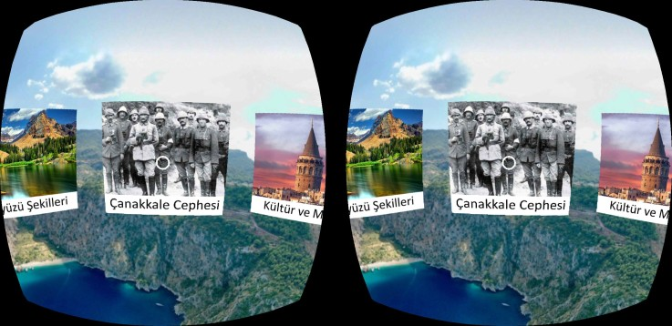
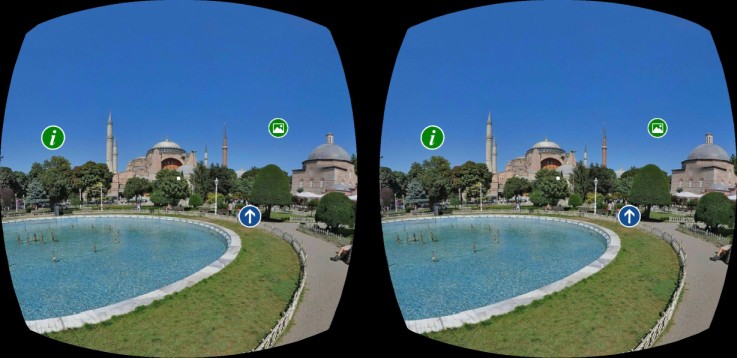

# Utilizing Reduced Depth Effect For Education In Virtual Reality

## Abstract

The technology has greatly changed and diversified the ways of teaching and learning. Virtual reality (VR) is the latest addition to this trend. Although it is vastly used for entertainment and professional training purposes, its implementation into education is yet far from its full potential. The purpose of this study was to offer a simpler development approach to educational VR applications by removing some virtual reality elements, yet preserving the key elements like interaction, immersion and fun. To achieve this, we developed an educational VR application and conducted experiments. The participants of the study is consisted of 48 5th, 6th, 8th and 10th grade students and 4 teachers from a public school in Istanbul, Turkey in 2019-2020 educational year. In order to measure student motivation and cybersickness, we used Instructional Materials Motivation Survey (IMMS) and Simulator Sickness Questionnaire (SSQ) to gather quantitative data, respectively. The teachers also involved in the application development phase and reflected their opinions about VR teaching after the experiment to provide qualitative data. We applied descriptive, t-test and ANOVA statistical methods to analyze the data. The results showed that the students enjoyed VR learning and teachers had positive attitudes for VR teaching. Our results suggest that an educational virtual reality tool that has minimal VR elements is feasible.

## Images

#### Course Selection Screen

#### Icons in a Scene

#### Text and Image Tooltips

#### Students Using VR
